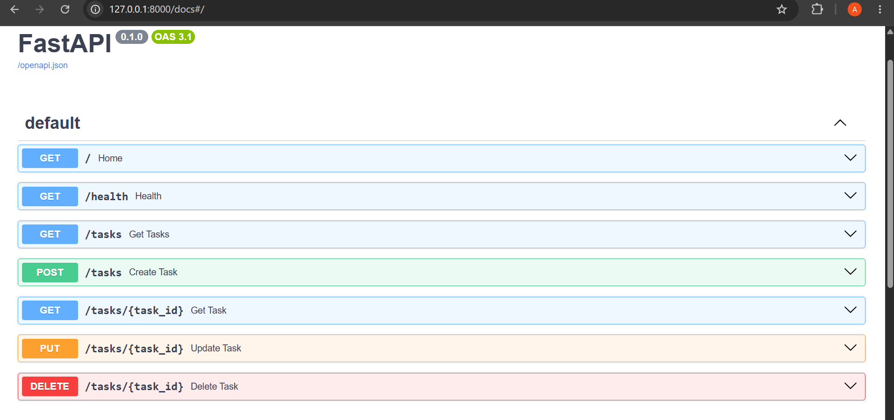

# Task API

A simple RESTful Task Management API built using **FastAPI**.

## Features

- Create a new task
- View all tasks
- View a single task
- Update an existing task
- Delete a task
- Health check endpoint
- Interactive Swagger documentation

## Technologies Used

- Python 3
- FastAPI
- Uvicorn
- Pydantic

## Installation

Clone the repository:

```bash
git clone https://github.com/amnahashim-1/task-api.git
```

Go to the project folder:

```bash
cd task-api
```

Install dependencies:

```bash
pip install fastapi uvicorn
```

Run the server:

```bash
uvicorn main:app --reload
```

The API will be available at:

```
http://127.0.0.1:8000
```

Swagger UI:

```
http://127.0.0.1:8000/docs
```

---

## API Endpoints

| Method | Endpoint | Description |
|--------|----------|-------------|
| GET | / | Home |
| GET | /health | Health Check |
| GET | /tasks | Get all tasks |
| GET | /tasks/{task_id} | Get one task |
| POST | /tasks | Create task |
| PUT | /tasks/{task_id} | Update task |
| DELETE | /tasks/{task_id} | Delete task |

---

## Example Response

```json
{
  "id": 1,
  "title": "Study Backend",
  "done": false
}
```
## Swagger UI


## Author

**Amna Hashim**